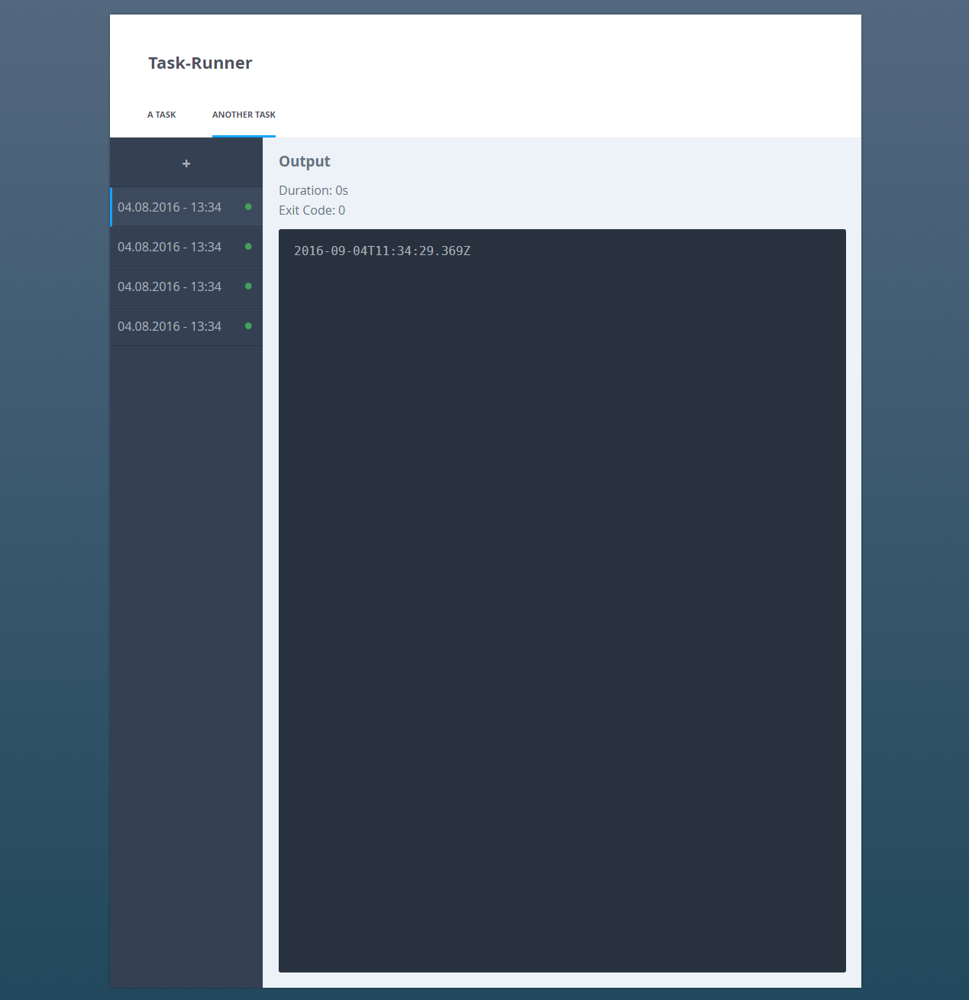

# Task Runner
A very simple webapp which should act as a cron replacement with a web-interface.
You may define tasks in a `tasks.json` file:

```json
[{
	"name": "A Task",
	"script": "/usr/bin/cat",
	"args": [ "/etc/fstab" ]
}, {
	"name": "Another Task",
	"script": "/usr/bin/date"
}]
```

You can then run any of these tasks through a web UI:


## Setup
To get started, simply clone this repository, run `npm install -g` and then start the application via `task-runner`.

You may set the following environment variables to configure the application:

* `PORT`: The port to run the application on. Defaults to 3000
* `TASKFILE`: The file from which to read the task definitions. Defaults to `tasks.json` in the current working directory.
* `DATABASE`: The sqlite database file to save information about previous task invocations to. Defaults to `tasks.db` in the current working directory.

## TODO
* Definable Intervals / Automatic running of tasks
